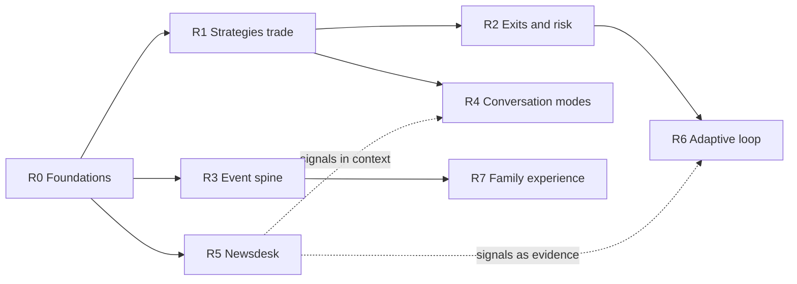

# Bellwether Roadmap (R0–R7)

Eight phases turning the 2026-08-20 platform review into a build order, optimized for
the strongest long-term architecture, with clean cutovers wherever downtime buys
simplicity. Baseline: commit `fffbc02`. Phases are prefixed "R" to avoid colliding
with the P-phase codes already used in the portal UI.

Companion review ("Bellwether Next", the *why* behind each phase):
<https://claude.ai/code/artifact/5abd28d3-1b62-4aa3-bf88-b6a2d3e60b02>

## Operating constraints

- **Downtime is free.** This is a paper-money platform with a family audience — no
  parallel-run migrations, no dual-write shims, no compatibility flags. Every phase
  may take the system down, cut over cleanly, and bring it back. The roadmap spends
  that freedom deliberately: each phase ends with the old path deleted, not deprecated.
- **Strongest wins over quickest.** Where the review offered a cheap first cut and a
  structural option, this roadmap picks the structural option and sequences it early
  so later phases build on rock.
- **One invariant survives everything: paper money only.** The live-broker path
  remains a refusing, design-only stub through every phase here.

## Architectural pillars

Seven decisions the phases build toward. Each is stated once here; the phases
reference them rather than re-arguing them.

1. **One runtime, three processes.** The whole repo standardizes on Node 24.18+
   (Bellwether's own `engines: >=22` already permits it, and mission-pipeline
   requires it). Server, trading worker, and newsdesk worker are separate processes
   in one codebase with one toolchain, one Postgres, separate schemas. No
   separately-toolchained sidecar.
2. **Postgres is the spine.** Strategies in the database drive trading. Evidence —
   decisions, events, receipts, pipeline attempts — is append-only. Every
   multi-write seam is transactional (the non-transactional `acceptProposal` is the
   standing counter-example to fix).
3. **An event spine.** One append-only `platform_events` table plus an SSE endpoint.
   UI liveness, notifications, off-cadence cycle triggers, and any future
   integration all ride the same log instead of growing bespoke channels.
4. **Deterministic core, advisory models.** The existing discipline — LLMs veto or
   narrate, never override rails — extends unchanged to exits, regimes, and
   allocation. Adaptation is always "deterministic rule in, parameter set out,
   logged."
5. **One choke point for change.** The proposal inbox is the only path from any
   suggestion — worker, chat, allocator — to a strategy mutation. Chat never
   mutates, in any mode, ever.
6. **Every model call is metered.** mission-pipeline's usage-receipt floor becomes a
   platform-wide rule: cycle agents, chat, brief, proposals, and newsdesk all emit
   receipt rows to one ledger.
7. **Untrusted text is fenced.** News and X content entering any prompt goes through
   injection fencing (mission-swarm's pattern, adopted as a shared utility) — the
   rails cap the blast radius; fencing shrinks the attack surface.

## Phase map

Solid = hard dependency; dashed = enriches, does not block. R0 unblocks three
parallel tracks. The trading track (R1→R2→R6) and the platform track (R3→R7) share
nothing until the end; the newsdesk (R5) is independent after R0 and plugs its
signals into R4 and R6 when both sides are ready.

| Phase | Name               | Delivers                                                                 | Cutover                              | Size |
| ----- | ------------------ | ------------------------------------------------------------------------ | ------------------------------------ | ---- |
| R0    | Foundations        | Node 24, per-user auth, LLM ledger + fencing utilities, test harness     | Runtime + auth model swap            | M    |
| R1    | Strategies trade   | Postgres strategies drive cycles; virtual books; per-strategy universes  | Retire the synthetic Cycle-A loop    | L    |
| R2    | Exits & risk       | Full position lifecycle; portfolio rails; drawdown ladder                | Playbook schema change               | M    |
| R3    | Event spine        | `platform_events` + SSE; live portal; scheduler surface; corpus browser  | Manual-refresh model retired         | M    |
| R4    | Conversation modes | Inquire + Co-develop; promote-to-proposal; proposal kinds                | Chat schema + thread contract change | M    |
| R5    | Newsdesk           | mission-pipeline intake DAG; scored signals; budget gates                | Inline ingest loops retired          | L    |
| R6    | Adaptive loop      | Shadow replay; backtest-before-approve; regimes; allocation proposals    | None — additive                      | L    |
| R7    | Family experience  | Register split; decision replay; notifications; a11y/mobile pass         | Viewer UI replaced                   | M    |

---

## R0 — Foundations

**Goal:** reset the ground the platform stands on, so no later phase has to build on
sand or retrofit plumbing. Unblocks everything.

**Strong-way choices**

- **Node 24.18+ across the repo.** This is what lets mission-pipeline be a normal
  in-repo dependency later (R5) instead of a foreign sidecar. Consequence accepted:
  mission-swarm (engines `>=22.22 <23`) cannot join these processes — it stays
  deferred (see "Deferred and declined").
- **Per-user identity in trusted-proxy mode.** Today every proxied request acts as
  the single shared admin. Map proxy identities to real portal users with individual
  roles; password mode demotes to a dev-only fallback. Role checks stop being one
  collapsed boolean.
- **The LLM ledger.** One shared wrapper around `ReasoningModel` that records a
  usage-receipt row (model, tokens, cost estimate, caller, cycle/thread id) for
  *every* call — cycle agents, chat, brief, proposals. This is pillar 6 landing
  first, so every later feature is metered from birth. It also centralizes timeouts,
  retries, and the hand-rolled schema validation that's currently scattered
  per-agent.
- **Fencing utility.** A shared fence for untrusted text (news titles/excerpts,
  X posts) entering prompts, applied immediately to the brief and analyst prompts.
  Pillar 7, landed before the newsdesk raises the volume.
- **Test harness.** The client has zero tests today. Stand up client testing, an
  integration fixture with a fake broker and scripted model, and keep the
  store-conformance style the server tests already use.

**Cutover:** runtime upgrade and auth swap in one downtime window. Existing password
sessions die; nobody will miss them.

**Exit criteria**

- Platform boots and all tests pass on Node 24; CI pins it.
- Two different proxied users land as two different portal identities with distinct
  roles.
- Every existing LLM call site routes through the ledger; a receipts table shows
  rows per cycle.

## R1 — Strategies trade

**Goal:** close the platform's central disconnect: the strategies the portal governs
become the strategies that trade. The keystone phase.

**Strong-way choices**

- **Virtual books, not just labels.** Each strategy gets an equity allocation
  fraction, its own cash ledger, and position *lots* (entry price, time, quantity
  per fill). Attribution, exits with per-lot P&L (R2), and meta-allocation (R6) all
  depend on lots existing — designing them in now is the whole point of doing this
  phase strong.
- **Per-strategy sub-cycles.** One paced cycle iterates active strategies from
  `PostgresStrategyStore`; each runs the full playbook → analyst → risk → execution
  chain against its own book and parameters. The broker's strategy gate becomes a
  real check instead of a tautology.
- **Universe as data.** Per-strategy watchlists (symbol + sector) with portal CRUD
  replace the hard-coded AAPL array. The analyst receives top-N ranked candidates,
  not `candidates[0]`.
- **Transactional seams.** `acceptProposal` becomes one transaction; sub-cycle
  writes (decision log + book mutation + next-job re-arm) commit atomically.

**Cutover:** delete `createActiveLiveStrategy` and the neutered parameter override
wholesale. Historical decision logs keep their legacy `5555…` strategy id; seed one
retired "Legacy demo" strategy row so old logs render honestly. Trading resumes only
when at least one real strategy is activated through the portal — a deliberate
moment: the family activates its first real strategy.

**Exit criteria**

- Editing parameters or pausing a strategy in the portal demonstrably changes the
  next cycle's behavior.
- Two active strategies trade side by side with independent books; the positions
  panel resolves names and true per-strategy P&L.
- An accepted proposal's draft strategy can be approved, activated, and observed
  trading.

## R2 — Exits & risk

**Goal:** a position the system can open but never close isn't a strategy — complete
the trade lifecycle and harden the rails around it.

**Strong-way choices**

- **Exits are rails, not vibes.** Deterministic exit rules join the playbook
  parameters: stop-loss fraction, take-profit fraction, max holding period,
  momentum-reversal exit — evaluated per lot each cycle. The agent team reviews
  discretionary early exits exactly the way it reviews entries; deterministic exits
  fire regardless of what any model says.
- **Sell vocabulary end to end.** Analyst may propose sells from held lots; rails
  already model sell-side limits; the adapter payload gains what it needs while
  keeping the whitelist discipline.
- **Portfolio-level rails.** Gross exposure cap, whole-book sector concentration, a
  graduated drawdown ladder (half sizing past X%, halt past Y%) replacing the binary
  daily stop, and no-trade windows around open/close.
- **Risk agent context.** Portfolio, full rails object, and the qualitative brief —
  the judgment step finally gets something to judge.

**Exit criteria**

- A position opens and later closes via a deterministic stop with the exit logged as
  a first-class decision.
- The drawdown ladder's stages trip correctly in integration tests against the fake
  broker.

## R3 — Event spine

**Goal:** replace the click-refresh portal with a platform that tells you what
happened — one log, one push channel, every consumer. Runs parallel with R1.

**Strong-way choices**

- **`platform_events` append-only table** written transactionally alongside the
  things it describes: cycle completed, order placed, proposal created, strategy
  transitioned, drawdown tripped, signal sealed (R5 joins later). This is
  infrastructure for four consumers at once — live UI, notifications, off-cadence
  triggers, audit.
- **SSE endpoint** on the existing hand-rolled server (no new dependencies), with
  cursor catch-up so a reconnecting client replays what it missed. Client subscribes
  and invalidates slices by event type; manual refresh buttons stay as a fallback,
  stop being the mechanism.
- **Scheduler surface.** Cadence and next-run time become visible and editable in
  the portal — the thing that actually schedules trading currently has no UI at all.
  "Start One Cycle" becomes an honest "Run a cycle now."
- **Corpus browser.** `GET /portal/qualitative` with ticker/source filters over
  `qualitative_items` (indexes already exist) and a News tab. R5 later upgrades this
  same surface to scored signals.
- **Session mechanics.** URL-routed tabs, one global 401 → re-login flow, store
  cleared on sign-out, equity history charted from the broker snapshots already
  stored in every decision log.

**Exit criteria**

- A cycle completing updates decisions, positions, and the equity chart with no user
  action.
- The News tab browses the live corpus; the scheduler's next run is visible and its
  cadence editable.

## R4 — Conversation modes

**Goal:** two explicit regimes for talking to the agent team — questions that can't
touch anything, and co-development with a paper trail — with the difference enforced
by schema, not by tone.

**Strong-way choices**

- **Mode is a contract.** Required explicit field (segmented control; the silent
  keyword inference in `inferChatMode` is deleted), per-mode system prompt, per-mode
  response schema validated server-side, mode stamped on every stored message and
  shown on every bubble.
- **Inquire** — structurally side-effect-free: the response schema *has no* delta or
  candidate fields and the server strips any that appear. Context assembly is the
  real build: strategy + parameters, playbook snapshot, positions, recent decision
  logs, and news (signals after R5, brief before). Open to viewers — this is the
  family's "why did it do that?" window, with an *Ask about this decision* deep link
  on every decision card.
- **Co-develop** — manager/admin; formalize and brainstorm become sub-intents. Every
  structured suggestion carries **Promote to proposal**, writing a
  `strategy_proposals` row with `source: 'chat'`. Proposals gain a `kind`:
  `new_strategy` or `parameter_delta` targeting an existing strategy. The inbox
  remains the single choke point (pillar 5): chat authors proposals; only review
  applies them.
- **Operator actions stay buttons.** No "act" mode. Discussion and change remain
  visibly different acts.

**Exit criteria**

- A viewer asks about a specific decision and gets an answer citing that log entry;
  a schema test proves Inquire replies cannot carry proposals.
- A manager promotes a chat delta, reviews it in the inbox, accepts it, and watches
  the parameter change take effect in the next cycle.

## R5 — Newsdesk

**Goal:** news intake becomes a durable, metered, auditable mission-pipeline DAG in
its own worker process — and its output becomes a first-class domain object: the
scored signal. Parallel track after R0.

**Strong-way choices**

- **In-repo worker, own schema.** With R0's Node 24 standardization done, the
  newsdesk is a third process in the same codebase. mission-pipeline vendored/pinned
  exactly once (its `instanceof` failure taxonomy demands a single copy); pipeline
  evidence lives in its own Postgres schema, never mixed with trading tables.
- **Postgres `PipelineStore` built to the conformance suite.** The engine ships
  reference DDL (14 tables); jobtrack ships a complete worked store and a
  conformance suite that validates any adapter. Passing that suite is the acceptance
  test, not hand-run happy paths.
- **The DAG:** collectors (RSS, Alpaca websocket, X) write raw items → *normalize*
  (code, sealed `qualitative-item.v1` contract) → *dedupe + enrich* (code;
  cross-source dedup, ticker extraction against a real symbol directory) →
  *watchlist gate* (code; the websocket subscribes to the whole market — only
  relevant items spend tokens) → *classify* (model; relevance, sentiment, event
  type, tickers with confidence; receipts mandatory) → *seal signal* (code,
  terminal) → outbox → `qualitative_signals` + a `platform_events` row.
- **Budget gates.** A daily news token budget enforced by a gate node with
  termination certificates — overspend is structurally impossible, not just
  monitored.
- **Signals over ratings.** The brief service ranks by relevance score; the News tab
  shows classifications and scores; Inquire cites signals; a high-severity signal
  may enqueue one off-cadence cycle through the existing `agent_jobs` chain, still
  behind the runtime enable flag and market clock.

**Cutover:** the inline normalize/dedupe logic in the trading worker's ingest loops
is retired wholesale; collectors become thin fetchers. The old corpus stays
readable; new items flow only through the DAG.

**Exit criteria**

- The store passes jobtrack's conformance suite; a poisoned article lands in dead
  letters without stalling its batch.
- An article traverses to a scored signal visible in the News tab, with its
  per-article model cost in the ledger.
- A high-severity signal enqueues an off-cadence cycle during market hours, and the
  resulting decision log links back to the signal.

## R6 — Adaptive loop

**Goal:** the flywheel: measure every strategy, ground every proposal in evidence,
and let the system suggest its own evolution — with the operator's approval as the
only way anything changes.

**Strong-way choices**

- **Shadow replay.** A nightly job replays each strategy's playbook (a pure
  function) over trailing bars and records walk-forward health scores per strategy.
- **Evidence-based proposals.** The proposal agent's context grows rolling
  performance stats — hit rate, average win/loss, drawdown, exposure — computed from
  decision logs and the R1 books, so proposed deltas respond to results instead of
  the latest snapshot.
- **Backtest-before-approve.** Every proposal (worker- or chat-sourced) is
  automatically replayed old-vs-new over the trailing window; the diff renders in
  the proposal card. Review becomes an evidence decision.
- **Regime overlays.** A deterministic classifier (realized-vol percentile,
  trend-vs-chop) selects among per-regime parameter overlays a strategy declares;
  regime and chosen overlay are logged each cycle.
- **Allocation proposals.** A periodic allocator proposes shifting book fractions
  toward better risk-adjusted strategies (inverse-vol to start) — as a proposal kind
  through the same inbox, never auto-applied.

**Exit criteria**

- Every open proposal shows a backtest diff; a regime flip visibly switches a
  strategy's active overlay in its decision logs.
- An accepted allocation proposal rebalances the virtual books on the next cycle.

## R7 — Family experience

**Goal:** split the registers: the operator keeps the glass console; the family gets
a portal that narrates rather than dumps.

**Strong-way choices**

- **Family home for viewers:** equity curve, per-strategy performance cards, and a
  plain-language activity feed generated from the event spine and decision logs
  ("Sold 2 shares of NVDA at $1,190 — take-profit rule").
- **Decision replay:** each decision as a stepped timeline — quant screen → analyst
  thesis → risk verdict → execution → broker result — making explainability the
  product's signature feature.
- **Copy pass:** raw endpoints, phase codes, and HTTP-status errors leave every
  family-visible surface.
- **Notifications:** PWA push (manifest already exists) off the event spine — order
  placed, proposal awaiting review, drawdown tripped.
- **Accessibility and mobile pass:** real tablist semantics, `aria-live` regions,
  focus management, responsive cards replacing the min-width table on phones.

**Exit criteria**

- A viewer on a phone can follow a day's trading — what happened and why — without
  seeing a single endpoint path, ID chip, or raw JSON value.

---

## Deferred and declined

- **mission-swarm** — deferred, not declined. Its committee/ballot governance
  becomes interesting over signal severity and proposal review, but it currently
  requires Node 22-only processes (incompatible with the R0 standardization), needs
  six port implementations with only two shipped fakes, and has no external consumer
  yet. Revisit when its engines relax or a second consumer proves the ports. Its
  fencing pattern is already adopted in R0.
- **Persona panels in classify** (bull/bear fan-out/fan-in) — a natural R5 follow-on
  once single-classifier costs and value are observed; the branch-and-join shape is
  ready in the pipeline docs.
- **Real-money path** — unchanged and out of scope for every phase here. The flip
  design, two-operator gates, and refusing stub stay exactly as they are.
- **No message broker, no client replatform.** Postgres coordination and React+Redux
  both survive — strongest doesn't mean most technology. The jobs table, outbox
  pattern, and event spine cover coordination at this scale; the client gains
  routing and tests, not a framework.

## Definition of done, every phase

Each phase lands with: migrations in `db/bootstrap` numbered and idempotent;
integration tests through the fake broker/model fixture; client tests for new UI;
receipts flowing for any new model call; events emitted for any new state change;
and a short update to the README's component decomposition. Since downtime is free,
no phase ships compatibility shims — each ends with the old path deleted, not
deprecated.
